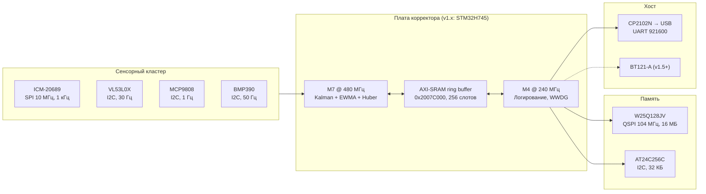

# HLD: Внедрение плат баллистического корректора

**Документ**: High-Level Design — интеграция аппаратных платформ
**Дата**: 2026-07-29
**Ревизия**: 1.0
**Статус**: Утверждён к реализации (v1.x), рекомендация по v2.0

---

## 1. Цели и рамки

Определить архитектуру внедрения трёх кандидатов-платформ:

| Платформа | Роль в проекте | Решение |
|-----------|----------------|---------|
| **STM32H745** (dual-core M7+M4) | Базовая плата v1.x — real-time корректор | ✅ **В производство** (Gerber lock 2026-08-11) |
| **STM32N6** (M55 + Neural-ART NPU) | Плата v2.0 — edge AI анализ выстрела | ✅ **Рекомендована** для v2.0 |
| **STM32MP2** (A35 + M33 + Linux) | Альтернатива v2.0 | ❌ **Отклонена** (обоснование в §3) |

Документ фиксирует: сравнение и выбор, системную архитектуру, дерево питания,
карту интерфейсов, стратегию совместимости плат между поколениями и план
разводки PCB в KiCad.

---

## 2. Системный контекст



**Ключевые требования (неизменны для всех поколений плат):**

- Латентность измерение → оценка: **< 20 мс** (жёсткое real-time)
- Частота IMU: **1 кГц**, без потерь выборок
- Диапазон: -10…+85 °C, 18g катастрофический предел
- Целостность логов: CRC32 на каждый пакет во Flash
- Двойной watchdog: IWDG 30 с (M7) + WWDG ~1 с (M4)

---

## 3. Сравнение платформ и решение

### 3.1 Сводная таблица

| Критерий | STM32H745 (v1.x) | STM32N6 (v2.0) | STM32MP2 |
|----------|------------------|----------------|----------|
| Ядра | M7 480 МГц + M4 240 МГц | M55 800 МГц (Helium) + NPU | 2×A35 1.5 ГГц (64-bit) + M33 |
| AI-ускоритель | нет (CMSIS-DSP) | **Neural-ART, 600 GOPS** | NPU 1.35 TOPS (только int8) |
| Энергоэффективность AI | — | **3 TOPS/Вт** | ~0.5–1 TOPS/Вт (+ SoC overhead) |
| SRAM на кристалле | 1 МБ | **4.2 МБ** | требуется внешняя DDR4/LPDDR4 |
| ОС | bare-metal / RTOS | bare-metal / RTOS | Linux (+ M33 bare-metal) |
| Гарантия латентности <20 мс | ✅ детерминированная | ✅ детерминированная | ⚠️ только через M33-домен; Linux — нет |
| Время готовности после подачи питания | < 100 мс | < 200 мс | 2–10 с (загрузка Linux) |
| Потребление (типовое активное) | ~0.6 Вт | ~0.8 Вт | 2–4 Вт (+DDR, +PMIC) |
| Сложность PCB | 4 слоя, LQFP144 | 6 слоёв, VFBGA | **8+ слоёв**, DDR-разводка, PMIC |
| BOM-стоимость платы | ~$45 | ~$60 | ~$110 |
| Готовность ПО проекта | **100% драйверов написано** | портирование ~2 недели | порт на Linux ~2 месяца |

### 3.2 Решение

**v1.x — STM32H745 остаётся без изменений.** Критический путь (Gerber
2026-08-11, MCU lead time 8–12 недель) не допускает смены платформы. Все 7
драйверов, session manager и PAT уже реализованы под H745.

**v2.0 — STM32N6 (STM32N657X0).** Обоснование:

1. **Тот же класс real-time**: M55 — микроконтроллерное ядро, латентность
   детерминирована, наш код (Kalman/EWMA/Huber) портируется почти без
   изменений; Helium (MVE) даёт ×4–8 на векторной математике фильтра.
2. **NPU 600 GOPS @ 3 TOPS/Вт** закрывает фичи v2.0:
   классификация типа выстрела по вибрационной сигнатуре (1D-CNN по окну IMU),
   акустическая детекция, предсказание теплового дрейфа нейросетью вместо
   Huber-регрессии.
3. **4.2 МБ SRAM** — модель + кольцевые буферы без внешней DDR → PCB остаётся
   6-слойной, без PMIC и DDR-топологии.
4. Единая экосистема STM32Cube/HAL → драйверы переиспользуются.

**STM32MP2 — отклонена** для данного изделия:

- Linux не гарантирует <20 мс без выноса всего real-time контура в M33 — тогда
  A35/NPU становятся балластом за 2–4 Вт и $65 надбавки к BOM.
- NPU принимает только int8-квантованные модели — хуже для регрессии дрейфа.
- DDR + PMIC → 8+ слоёв, HDI, рост стоимости и сроков верификации SI.
- Время загрузки 2–10 с неприемлемо для полевого включения.
- Ниша MP2 (HMI, IIoT-шлюзы, PLC) не совпадает с задачей прибора.

### 3.3 Стратегия совместимости v1.x → v2.0

Чтобы плата N6 была **drop-in заменой** в том же корпусе:

- Единый **габарит 80×60 мм** и позиции крепёжных отверстий (4×M3).
- Единый **сенсорный разъём J4 (14-pin, 2.54 мм)** — пиновка фиксируется в §5.4
  и не меняется между поколениями.
- Единый вход питания **12 В** (barrel jack) и одинаковые уровни IO 3.3 В.
- UART-протокол хоста (921600, кадры с CRC32) — стабильный ABI.
- Формат сессий во Flash (session_manager) — версионируемый заголовок,
  read-совместимость v2.0 ← v1.x.

---

## 4. Архитектура платы v1.x (STM32H745)

### 4.1 Функциональные блоки

| Блок | Компоненты | Шина / связь |
|------|-----------|--------------|
| MCU | STM32H745ZIT6 (LQFP144) | — |
| Питание | TPS62133A (12→5 В), LDO 3.3 В/500 мА, LDO 1.8 В/200 мА | — |
| IMU | ICM-20689 | SPI1 @ 10 МГц |
| Дальномер | VL53L0X | I2C1 @ 400 кГц |
| Температура ствола | MCP9808 | I2C1 |
| Барометр | BMP390 | I2C1 |
| Лог-память | W25Q128JV 16 МБ | QUADSPI @ 104 МГц |
| Конфигурация | AT24C256C 32 КБ | I2C1 |
| Отладка | CP2102N (USB-UART), SWD 10-pin | USART2 |
| BLE (v1.5+) | BT121-A | UART4 |
| Клок | HSE 8 МГц + 2×12 пФ (1%) | PH0/PH1 |

### 4.2 Дерево питания

```
12V DC (J1, barrel 5.5/2.1) ──► D1 Schottky (защита переполюсовки)
        │
        ▼
  TPS62133A buck ──► 5V @ 1A
        ├─► LDO U3 ──► 3V3 @ 500 mA ──► MCU VDD, сенсоры, Flash, EEPROM, CP2102N
        ├─► LDO U12 ─► 1V8 @ 200 mA ──► VDD_IO bank (QSPI домен, опция)
        └─► 5V ──────────────────────► USB VBUS-домен
Бюджет: MCU 280 мА + Flash(pgm) 25 мА + сенсоры 45 мА + CP2102N 20 мА
        = 370 мА @ 3V3 (запас 26%)
```

### 4.3 Карта пинов (ключевые интерфейсы)

> ⚠️ **Исправление конфликта**: в схеме rev 1.0 QSPI_CS был указан на PA3,
> который уже занят USART2_RX. QSPI BK1_NCS переносится на **PB6 (AF10)**.
> Отражено ниже и в netclass-плане KiCad.

| Сигнал | Пин | AF | Netclass |
|--------|-----|----|----------|
| SPI1_SCK / MISO / MOSI | PA5 / PA6 / PA7 | AF5 | SPI_FAST |
| SPI1_CS_IMU (GPIO) | PB0 | — | SPI_FAST |
| IMU_INT | PB1 (EXTI1) | — | Default |
| QSPI_CLK | PB2 | AF9 | QSPI_50R |
| QSPI_BK1_IO0..IO3 | PD11 / PD12 / PE2 / PD13 | AF9 | QSPI_50R |
| QSPI_BK1_NCS | **PB6** | AF10 | QSPI_50R |
| I2C1_SCL / SDA | PB8 / PB9 | AF4 | I2C (10k pull-up к 3V3) |
| USART2_TX / RX | PA2 / PA3 | AF7 | Default |
| USB_HS DM / DP | PA11 / PA12 | AF10 | USB_90R (диффпара) |
| SWDIO / SWCLK | PA13 / PA14 | — | Default |
| HSE OSC_IN / OSC_OUT | PH0 / PH1 | — | XTAL (короче 5 мм) |
| NRST | NRST | — | RC 10k/100 нФ |
| BOOT0 | BOOT0 | — | SW1 + 10k pull-down |

### 4.4 Карта памяти (межъядерное взаимодействие)

| Регион | Адрес | Назначение |
|--------|-------|-----------|
| AXI-SRAM ring buffer | 0x2007C000 | IPC M7→M4, 256 слотов измерений |
| HSEM | — | Синхронизация доступа к кольцу |
| QSPI memory-mapped | 0x90000000 | Чтение сессий без драйвера (XIP-read) |

---

## 5. План разводки PCB (KiCad) — стартовая фиксация

Проект: `hardware/STM32H745_Ballistic_Corrector.kicad_pro` (+ `.kicad_pcb`,
`.kicad_dru`) — **создан в этом коммите**, привязан к существующей схеме.

### 5.1 Стек слоёв (4 слоя, 1.6 мм, FR-4, медь 2 oz внешние / 1 oz внутренние)

| # | Слой | Назначение | Диэлектрик до следующего |
|---|------|-----------|--------------------------|
| L1 | F.Cu | Сигналы + компоненты (вся установка на верх) | prepreg 7628, 0.2 мм |
| L2 | In1.Cu | **Сплошной GND** (без разрывов под QSPI!) | core 1.065 мм |
| L3 | In2.Cu | Питание: полигоны 3V3 / 1V8 / 5V | prepreg 7628, 0.2 мм |
| L4 | B.Cu | Сигналы (медленные), силовая разводка 12 В | — |

Импеданс при этом стеке: **50 Ω single-ended ≈ 0.28 мм** ширина на L1 над L2;
**90 Ω diff (USB) ≈ 0.20 мм / зазор 0.15 мм**.

### 5.2 Классы цепей (занесены в .kicad_pro)

| Netclass | Ширина | Зазор | Via | Цепи |
|----------|--------|-------|-----|------|
| Default | 0.20 мм | 0.15 мм | 0.6/0.3 | GPIO, UART, INT |
| QSPI_50R | 0.28 мм | 0.20 мм | 0.6/0.3 | QSPI_CLK, D0–D3, NCS |
| SPI_FAST | 0.20 мм | 0.15 мм | 0.6/0.3 | SPI1_* |
| I2C | 0.25 мм | 0.15 мм | 0.6/0.3 | I2C1_SCL/SDA |
| USB_90R | 0.20 мм | 0.15 мм | 0.6/0.3 | USB_DP/DM (диффпара) |
| Power_3V3/1V8 | 0.50 мм | 0.20 мм | 0.8/0.4 | VCC_3V3, VCC_1V8 |
| Power_12V/5V | 1.00 мм | 0.25 мм | 1.0/0.5 | VCC_12V, VCC_5V |

### 5.3 Флорплан (плата 80×60 мм, компоненты сверху)

```
┌──────────────────────────────────────────────────────────────┐ 60
│ H1○  J1[12V]  ПИТАНИЕ: D1,U2(buck),L1,U3/U12(LDO)     H2○   │
│      ─────────────────────────────────────────────────       │
│  J2[UART]                                    ┌─────────┐     │
│  J3[SWD]          ┌──────────────┐  ≤25 мм   │U6 QSPI  │     │
│  U8[CP2102N]      │ U1 STM32H745 │◄────────► │  Flash  │     │
│  J5[USB]          │   LQFP144    │           └─────────┘     │
│                   │  Y1+C 8 МГц  │           U7[EEPROM]      │
│                   └──────────────┘                           │
│      U4[IMU ICM-20689]  U10[MCP9808]  U11[BMP390]            │
│ H3○  U5[VL53L0X]  J4[Sensor 14-pin]  TP1..TP6         H4○   │
└──────────────────────────────────────────────────────────────┘ 80
```

Правила размещения:

1. **QSPI-кластер**: U6 не далее 25 мм от банков QSPI-пинов U1; длины всех
   6 цепей выровнять до **±0.5 мм** (скью <0.1 нс уже с запасом).
2. **Кварц Y1**: <5 мм от PH0/PH1, guard-ring GND, не пересекать сигналами.
3. **Развязка**: 100 нФ на каждый VDD-пин <2 мм; bulk 10 мкФ на группу.
4. **IMU U4**: в геометрическом центре крепёжных отверстий (минимум изгибных
   резонансов), ось X вдоль длинной стороны платы.
5. **VL53L0X**: у края платы, апертура без препятствий (вырез в корпусе).
6. **Аналог/питание** сверху платы, **сенсоры** снизу зоны MCU — тепловой поток
   buck-преобразователя не греет MCP9808/BMP390.
7. GND-стежка (via stitching) шаг 5 мм по периметру и вокруг QSPI.

### 5.4 Пиновка J4 (сенсорный разъём, фиксируется для v1.x и v2.0)

| Pin | Сигнал | Pin | Сигнал |
|-----|--------|-----|--------|
| 1 | +3V3 | 2 | GND |
| 3 | I2C1_SCL | 4 | I2C1_SDA |
| 5 | SPI1_SCK | 6 | SPI1_MISO |
| 7 | SPI1_MOSI | 8 | SPI1_CS_IMU |
| 9 | IMU_INT | 10 | LRF_GPIO1 (data-ready) |
| 11 | LRF_XSHUT | 12 | TEMP_ALERT |
| 13 | резерв (v2.0: I3C) | 14 | GND |

### 5.5 Порядок работ по разводке

| Шаг | Работа | Оценка | Статус |
|-----|--------|--------|--------|
| 1 | Проект KiCad: стек, netclasses, DRC-правила, контур 80×60, крепёж | 2 ч | ✅ **сделано (этот коммит)** |
| 2 | Назначение футпринтов всем 41 позициям BOM, импорт нетлиста из схемы | 4 ч | 🟡 футпринты размещены генератором (`tools/gen_pcb_placement.py`); осталась сверка корпусов с даташитами + импорт нетлиста |
| 3 | Размещение по флорплану §5.3 | 8 ч | ✅ 48 компонентов + 4 крепёжа, коллизии courtyard = 0 |
| 4 | Fan-out LQFP144, развязка | 4 ч | ⏳ |
| 5 | Разводка QSPI (приоритет №1) + выравнивание длин | 6 ч | ⏳ |
| 6 | USB диффпара, SPI, I2C, UART | 6 ч | ⏳ |
| 7 | Полигоны питания L3, силовые цепи, stitching | 4 ч | ⏳ |
| 8 | DRC до нуля, ERC-кросс-чек со схемой | 4 ч | ⏳ |
| 9 | SI-симуляция QSPI @ 104 МГц, термо-FEA (<60 °C) | 8 ч | ⏳ |
| 10 | Gerber + drill + pick-and-place, **lock 2026-08-11** | 2 ч | ⏳ |

**Итого до Gerber lock: ~46 ч** при дедлайне 2026-08-11 (13 календарных дней) —
критический путь выполним при темпе ≥4 ч/день.

---

## 6. Архитектура платы v2.0 (STM32N6) — эскиз

Отличия от v1.x (сохранён габарит, крепёж, J4, питание 12 В):

| Подсистема | Изменение |
|-----------|-----------|
| MCU | STM32N657X0, VFBGA264 → 6 слоёв, микровиа не требуются (fan-out 0.8 мм) |
| Память моделей | + внешняя Octo-SPI PSRAM/Flash (модели >4 МБ), XSPI @ 200 МГц |
| Питание | + буфер 1.0 В core (встроенный SMPS N6 допускает единый 3V3-вход) |
| AI-конвейер | окно IMU 1024×6 → NPU (1D-CNN) → класс выстрела + прогноз дрейфа |
| Камера (опция) | MIPI CSI-2 разъём — "simple vision" контроль сработки |
| Firmware | драйверы переиспользуются; замена CMSIS-DSP ядра фильтра на Helium |

Решение о запуске v2.0 принимается после полевых испытаний прототипа v1.x
(план: 2026-09-25 + 4 недели испытаний).

---

## 7. Риски

| Риск | Вероятность | Митигация |
|------|-------------|-----------|
| Срыв Gerber lock 2026-08-11 | средняя | Шаг 1 выполнен; QSPI разводится первым; резерв — упростить BLE в NC |
| Импеданс 50 Ω вне ±5% | низкая | Стек согласован с профилем 7628 изготовителя; запрос impedance coupon |
| Конфликт PA3 (найден в rev 1.0) | устранён | QSPI_NCS → PB6, зафиксировано в §4.3 |
| Lead time STM32H745 8–12 нед. | высокая | RFQ по STM32H745_BOM_DIGIKEY_IMPORT.csv — отправить на этой неделе |
| N6: доступность инженерных образцов | средняя | Запрос к ST через дистрибьютора параллельно с v1.x |

---

*Связанные документы: PCB_LAYOUT_PLAN.md, HARDWARE_DESIGN.md,
IMPLEMENTATION_BACKLOG.md, STM32H745_BOM_DIGIKEY_IMPORT.csv*
